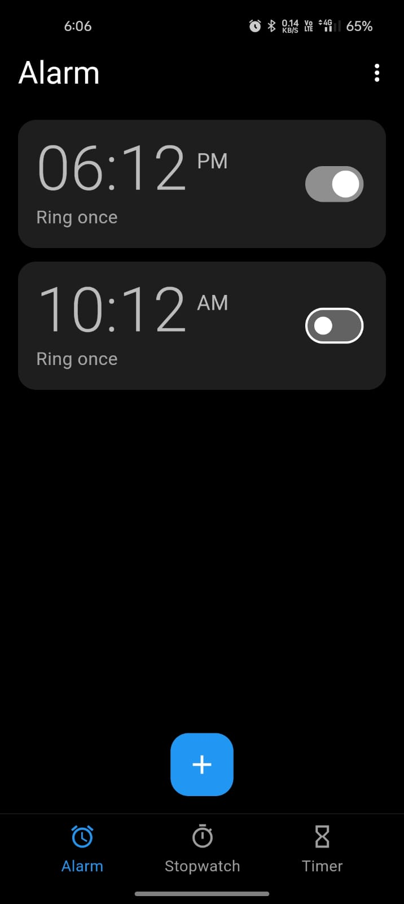
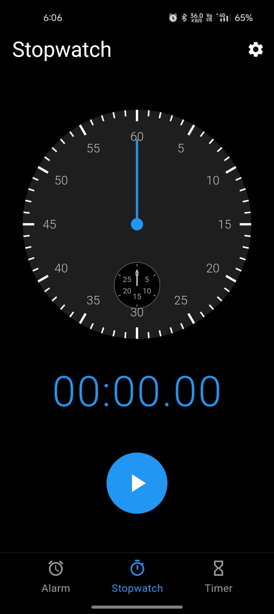
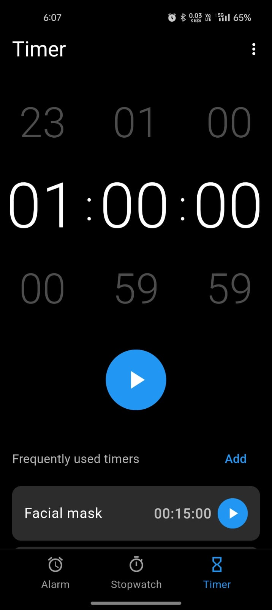

# Flutter Alarm App

A fully-featured alarm, timer, and stopwatch application built with Flutter for Android.

## Screenshots

<p align="center">
  
  
  
</p>

## Features

### 🔔 Alarm
- Create multiple alarms with custom names and times
- Set repeat days (Sunday through Saturday)
- Toggle alarms on/off
- Full-screen alarm ringing page with animated UI
- Snooze functionality (10 minutes)
- Dismiss alarm option
- Wake up device screen when alarm triggers
- Persistent alarm scheduling using Android AlarmManager

### ⏱️ Stopwatch
- Accurate stopwatch with millisecond precision
- Start, pause, and reset functionality
- Record lap times with timestamps
- Clean, minimalist UI design
- State persistence across tab changes

### ⏲️ Timer
- Customizable countdown timer (hours, minutes, seconds)
- Save frequently used timers with custom names
- Quick access to saved timers
- Start timer directly from saved list
- Edit and delete saved timers
- Full-screen timer ended page with alarm sound
- Add 1 minute option when timer finishes
- Keyboard input support for time setting
- Auto-select text on tap for easy editing
- State persistence - timer continues running when switching tabs

## Technologies & Architecture

### Frontend
- **Framework**: Flutter 3.22.3
- **Language**: Dart
- **State Management**: StatefulWidget with setState
- **Navigation**: PageView with PageController
- **Animations**: AnimationController, ScaleTransition, CurvedAnimation

### Native Android Integration
- **Language**: Kotlin 1.9.22
- **Build Tool**: Gradle 8.1.0
- **Min SDK**: 21 (Android 5.0)
- **Target SDK**: 34 (Android 14)

Note: I Recommend users to use java 17 to build.

### Key Components

#### Method Channels
- `flutter_alarmapp/ringtone` - Ringtone picker integration
- `flutter_alarmapp/alarm` - Alarm scheduling and sound control

#### Native Android Features
- **AlarmManager**: Schedule exact alarms with `setExactAndAllowWhileIdle()`
- **BroadcastReceiver**: Handle alarm triggers via `AlarmReceiver.kt`
- **RingtoneManager**: Play system alarm sounds
- **WakeLock**: Wake device screen when alarm/timer triggers
- **AudioAttributes**: Use ALARM audio stream for proper volume control

#### State Persistence
- **AutomaticKeepAliveClientMixin**: Preserve timer state across tab navigation
- **GlobalKey**: Maintain state references across widget rebuilds

### Dependencies

```yaml
dependencies:
  flutter:
    sdk: flutter
  cupertino_icons: ^1.0.8
  flutter_local_notifications: ^16.3.3
  timezone: ^0.9.4
  flutter_ringtone_player: ^4.0.0+4
  path_provider: ^2.1.4
```

## Project Structure

```
lib/
├── main.dart                      # App entry point
├── models/
│   └── alarm.dart                 # Alarm data model
├── pages/
│   ├── add_alarm_page.dart        # Create/edit alarm interface
│   ├── alarm_ringing_page.dart    # Full-screen alarm notification
│   ├── home_page.dart             # Main tab navigation container
│   ├── stopwatch_page.dart        # Stopwatch functionality
│   ├── timer_ended_page.dart      # Full-screen timer notification
│   └── timer_page.dart            # Timer functionality
├── screens/
│   └── home_screen.dart           # Legacy home screen
├── services/
│   ├── alarm_service.dart         # Alarm scheduling logic
│   └── notification_service.dart  # Notification management
└── widgets/
    ├── alarm_item.dart            # Alarm list item component
    └── circle_day.dart            # Day selector widget

android/app/src/main/kotlin/com/example/alarm_app/
├── MainActivity.kt                # Flutter-Android bridge
└── AlarmReceiver.kt              # Alarm broadcast receiver
```

## UI Design

### Theme
- **Primary Color**: Blue (#2196F3)
- **Background**: Black (#000000)
- **Cards**: Dark Gray (#1E1E1E)
- **Dialogs**: Medium Gray (#2C2C2C)
- **Text**: White with varying opacity

### Typography
- **Timer Display**: 72px, Light weight
- **Time Input**: 40px, Bold
- **Labels**: 24px, Medium weight
- **Body Text**: 14-16px

### Animations
- Pulsing alarm/timer icons (scale 0.95 to 1.05)
- Smooth fade transitions
- Ripple effects on buttons

## Permissions

Required Android permissions in `AndroidManifest.xml`:

```xml
<uses-permission android:name="android.permission.RECEIVE_BOOT_COMPLETED"/>
<uses-permission android:name="android.permission.VIBRATE" />
<uses-permission android:name="android.permission.USE_FULL_SCREEN_INTENT" />
<uses-permission android:name="android.permission.SCHEDULE_EXACT_ALARM" />
<uses-permission android:name="android.permission.USE_EXACT_ALARM"/>
<uses-permission android:name="android.permission.POST_NOTIFICATIONS"/>
<uses-permission android:name="android.permission.WAKE_LOCK"/>
```

## Installation

1. Clone the repository:
```bash
git clone https://github.com/Anshul-18/Myalarm.git
cd flutter_alarmapp
```

2. Install dependencies:
```bash
flutter pub get
```

3. Run the app:
```bash
flutter run -d <device_id>
```

## Building for Release

```bash
flutter build apk --release
```

The APK will be located at: `build/app/outputs/flutter-apk/app-release.apk`

## Platform Support

- ✅ Android (Fully supported)
- ❌ iOS (Not implemented)
- ❌ Web (Not implemented)
- ❌ Desktop (Not implemented)

## Known Issues & Limitations

1. Timer alarm sound requires app rebuild after native code changes
2. Developer Mode required for plugin symlink support on Windows
3. Some Gradle warnings related to deprecated plugin application methods

## Future Enhancements

- [ ] Alarm tone customization
- [ ] Vibration pattern options
- [ ] Multiple timer support
- [ ] Timer templates
- [ ] Alarm/timer statistics
- [ ] Dark/light theme toggle
- [ ] Export/import settings
- [ ] Widget support

## Contributing

1. Fork the repository
2. Create your feature branch (`git checkout -b feature/AmazingFeature`)
3. Commit your changes (`git commit -m 'Add some AmazingFeature'`)
4. Push to the branch (`git push origin feature/AmazingFeature`)
5. Open a Pull Request

## License

This project is open source and available under the [MIT License](LICENSE).

## Author

**Anshul**
- GitHub: [@Anshul-18](https://github.com/Anshul-18)

## Acknowledgments

- Flutter team for the amazing framework
- Material Design for UI inspiration
- Google Clock app for design reference 
